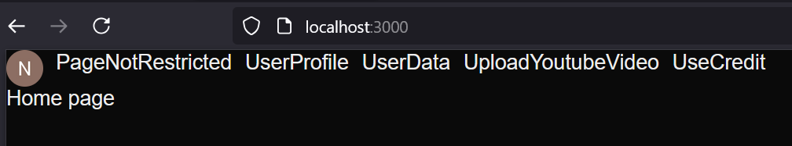
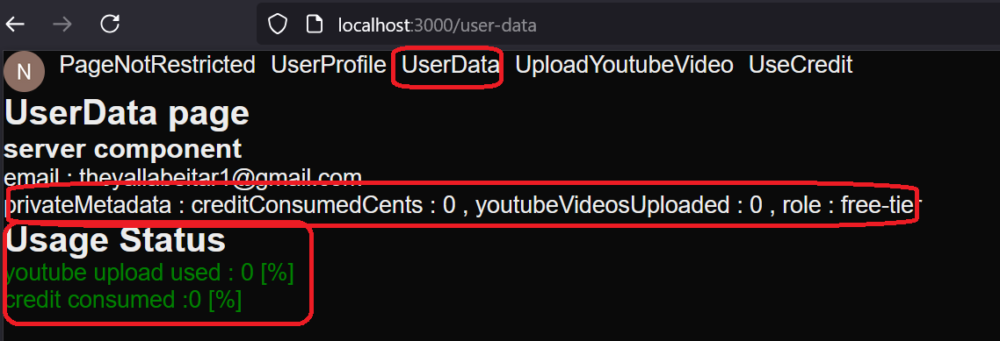
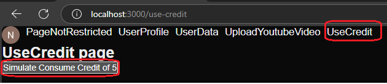
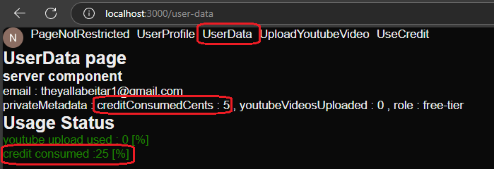
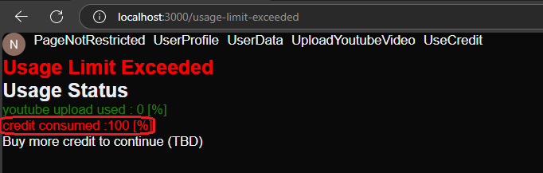

<h1>Project Name</h1>
Implementing Usage Limits for Free-Tier Users in Next.js


<h2>Project Description</h2>
<p>
  This project delivers a robust usage limiter for a Next.js video upload
  application, ensuring fair resource allocation for free-tier users. By
  leveraging Clerk for user management and enforcing credit-based limits, it
  effectively manages costs and maintains a positive user experience.
</p>

<h3>Core Features</h3>
<ul>
  <li><strong>Per-user credit tracking.</strong></li>
  <li>
    <strong>Clerk role-based limit enforcement (<code>admin</code>,
    <code>freeTier</code>).</strong>
  </li>
  <li><strong>Middleware prevents page access upon reaching limits.</strong></li>
  <li><strong>Prevent API calls exceeding limits with client-side checks.</strong></li>
</ul>

<h2>Motivation</h2>
<p>
  The current Post2Youtube Next.js application shares a single OpenAI API key
  among all users. This presents challenges in managing resource consumption,
  especially as the application scales and plans for paid tiers are developed.
  To address this, the immediate need is to implement usage limits for free-tier
  users.
</p>
<p>
  The specific requirements for the free tier are to limit each user to a maximum
  of 6 video uploads to YouTube and a total API cost of $0.20. The existing
  Clerk user management system, with its <code>admin</code> and
  <code>freeTier</code> roles, along with <code>clerkMiddleware</code> and
  <code>privateData</code>, provides a foundation for implementing these limits.
</p>
<p>
  To achieve this, the following functionalities are minimally required:
</p>
<ul>
  <li>Tracking the number of video uploads per user.</li>
  <li>Monitoring the API consumption costs associated with each user.</li>
  <li>Implementing a mechanism to notify users when they reach their limits and restrict access to relevant pages.</li>
</ul>
<p>The core question is how to integrate these requirements seamlessly within the existing Next.js and Clerk architecture.</p>

<h2>Installation</h2>
<p>
  To get started with this project, please follow the instructions in
  <a href='#ref1'>[1]</a> for creating the basic project structure.
</p>
<p>
  Additionally, refer to <a href='#ref2'>[2]</a> for detailed steps on how to
  create the necessary <code>admin</code> role within your Clerk dashboard.
</p>

<h2>Usage</h2>

Run the development server

```bash
npm run dev
```

<h2>Technologies Used</h2>
<ul>
<li>Clerk </li>
<li>Next.js App Router</li>
<li>Zod </li>
<li>TypeScript </li>
</ul>

<h2>Design</h2>

<h3>Tradeoffs</h3>
<p>
  Using <code>layout.tsx</code> as a server component offers improved security
  and performance. <strong>However, the tradeoff is that it initially
  forces all pages to also be server components</strong>, which lack
  client-side interactivity.
</p>
<p>
  <strong>Solution:</strong> To enable interactivity where needed, we extract
  interactive elements into small client components.
</p>


<h3>Constraints</h3>
<ul>
  <li>
    Using Clerk API in the free tier is limited. See the
    <a
      href='https://clerk.com/docs/backend-requests/resources/rate-limits'
      target='_blank'
      rel='noopener noreferrer'
      >Clerk Rate Limits</a
    > (including <code>currentUser</code>). Mitigate this by passing the
    <code>User</code> object as an argument e.g.,
    <code>getPrivateMetadata(user: User)</code> instead of repeatedly fetching
    it.
  </li>
</ul>

 <h3>Questions</h3>

<h4>Where to put common page navigation code</h4>
<p>Hooks, check e.g., <code>useNavigateOnUsageExceedLimit</code>.</p>


<h4>Pattern for actions</h4>
<ul>
  <li>
    Core logic in the <code>logic</code> folder to be used in middleware and
    server components (e.g., <code>canUploadYoutubeVideo</code>). This logic operates
    in a server environment with direct access to the Clerk <code>User</code> object.
  </li>
  <li>
    Action in the <code>actions</code> folder (Server Actions) to be used when
    triggered from the client. These actions (e.g.,
    <code>actionCanUploadYoutubeVideo</code>) handle retrieving or accessing the
    necessary <code>User</code> object on the server by using the core logic .
  </li>
</ul>


<h4>Where to check usage exceed limit</h4>
<ul>
  <li>
    <strong>Before navigating to a page:</strong> Seems better for enforcing
    limits based on user roles but could act as a gatekeeper, potentially
    blocking access prematurely.
  </li>
  <li>
    <strong>Before invoking a relevant function:</strong> Seems like the most
    precise and appropriate place to check usage when consumed on the client.
  </li>
</ul>


<h4>How to notify on usage exceed limit</h4>
<ul>
  <li>Navigate to a new page "Usage Limit Exceeded".</li>
  <li>Toast inline notification.</li>
</ul>
<p>
  When checking usage limits in <strong>middleware</strong>, navigating to a
  new page is the only viable option for notification, as inline toasts are not
  available in this server-side environment.
</p>
<p>
  While <strong>inline toasts</strong> could be used for client-side checks
  before invoking functions, the most effective solution overall is to
  <strong>navigate to a dedicated "Usage Limit Exceeded" page</strong>. This
  approach is consistent across both middleware and client-side checks.
</p>
<p>
  Furthermore, a dedicated page provides ample space to not only inform the user
  about the exceeded limit but also to suggest solutions such as purchasing more
  credit or upgrading to a paid tier for higher usage allowances. This level of
  guidance and potential for upselling is not easily achievable with inline
  toast notifications.
</p>


<h4>Usage limiter test</h4>
<p>
  The usage limiter is a super critical module, and therefore, automatic testing
  is required with 100% module test coverage. <strong>Note: These tests are
  not implemented in this initial project description but should be a
  prerequisite before deploying to production.</strong>
</p>

<h2>Code Structure</h2>

<h3>usage-limiter.ts</h3>
<p>This file contains <strong>crucial logic</strong> for the usage limiter. Below are examples demonstrating how credit consumption is checked and incremented.</p>

<h4>Checking if credit can be consumed (Example):</h4>

```ts
export const canConsumeCredit = async (user: User): Promise<boolean> => {
  const privateData = await getPrivateMetadata(user);

  if (!privateData) return false;

  const { creditConsumedCents } = privateData;

  const res = creditConsumedCents < MAX_CREDIT_CENTS;
  console.log(
    `canConsumeCredit . res : ${res} , creditConsumedCents : ${creditConsumedCents} , MAX_CREDIT_CENTS : ${MAX_CREDIT_CENTS}  `
  );

  return res;
};

```

<h4>Incrementing credit consumption (Example):</h4>

```ts

export const incrementCostByAmount = async (
  user: User,
  amount: number
): Promise<void> => {
  const hasCredit = await canConsumeCredit(user);

  if (!hasCredit) {
    throw new Error("credit usage exceeded");
  }

  const privateData = await getPrivateMetadata(user);

  if (!privateData) {
    throw new Error("Can not increment for empty privateData ");
  }

  privateData.creditConsumedCents += amount;

  await setPrivateMetadata(privateData);
};
```

<h4>Middleware check permission</h4>

```ts

    if (
      pageNeedUsagePermission &&
      !(await hasUsagePermission(user, pageNeedUsagePermission))
    ) {
      return NextResponse.redirect(
        new URL(PageUrl.UsageLimitExceeded, req.url)
      );
    }

```

<h3>Page check permission - ClientConsumeCreditButton</h3>

```tsx

  const clickHandler = async () => {
    const consumeCreditAllowed = await actionCanConsumeCredit();
    setCanConsume(consumeCreditAllowed);

    if (!consumeCreditAllowed) {
      router.push(PageUrl.UsageLimitExceeded);
      return;
    }
    await actionIncrementCostByAmount(CREDIT_AMOUNT);
    // Optionally, you might want to trigger a refresh or navigate elsewhere after incrementing
  };
```


<h2>Demo</h2>
<p>Home page for registered user (non-admin):</p>

<p>Check the usage after sign up:</p>

<p>Simulate consume credit by click on the button in the page UseCredit:</p>

<p>Navigate to user data:</p>

<p>
  Click three more times on the button; on the fourth, you will be directed to
  the "Usage Limit Exceeded" page because of the check in the
  <code>UseCredit</code> page:
</p>

<p>
  Click on the "UseCredit" tab again, and you will be directed to the "Usage
  Limit Exceeded" page again because of the middleware check.
</p>


<h2>Points of Interest</h2>
<ul>
  <li>
    This demo avoids real OpenAI API usage to keep the setup simple. Instead,
    credit consumption is simulated via button clicks, mimicking actual API
    costs.
  </li>
</ul>


<h2>References</h2>
<ol>
  <li id='ref1'>
    <a href='https://youtu.be/5zE_c5kDDDs?si=qwxnm54ILEVbTYR6'>
      Seamless User Management with Clerk and Next.js
    </a>
  </li>
  <li id='ref2'>
    <a href='https://youtu.be/JCnEFJbNyws?si=fSbTNLC0DcKwmUeo'>
      Mastering Role-Based Authorization with Clerk and Next.js
    </a>
  </li>
</ol>